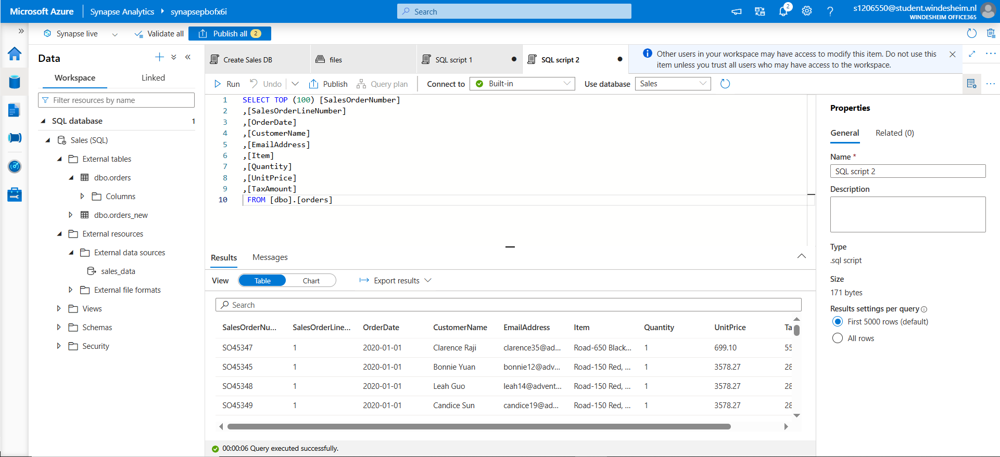
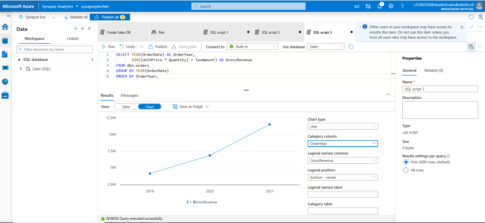

# 📊 Lab 02 - Analyze data with SQL

This lab focuses on querying and analyzing structured data using Serverless SQL Pools in Azure Synapse.

---

## 🔧 What I Did

### 1. Queried CSV Files with OPENROWSET

- Used `OPENROWSET` to read external CSV files stored in Azure Data Lake.
- Defined schema manually using the `WITH` clause for columns like `SalesOrderNumber`, `CustomerName`, `EmailAddress`, `Item`, `Quantity`, `UnitPrice`, and `TaxAmount`.
- Previewed data from the raw files in tabular form.

📷 *Screenshot:*  

---

### 2. Created External Table

- Created a SQL external table called `orders` in the `Sales` database using the external data source.
- Queried the external table to ensure proper linkage and correct results.

📷 *Screenshot:*  

---

### 3. Aggregated and Visualized Revenue

- Performed aggregation using `GROUP BY YEAR(OrderDate)`.
- Calculated `GrossRevenue` as:  
  `(UnitPrice * Quantity) + TaxAmount`
- Generated a **line chart** in Synapse Studio to visualize revenue trends per year.

📷 *Screenshot:*  

---

✅ **Result:** Learned how to query structured CSV data with SQL, build external tables, and visualize business metrics with built-in chart tools.
