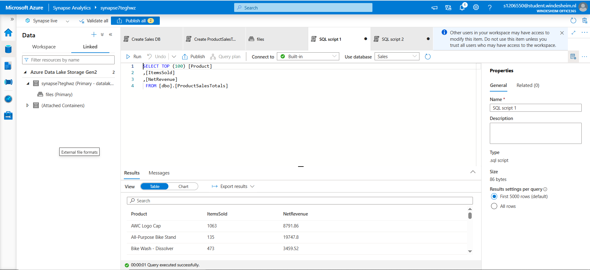

# Lab 3 - Transform Data with SQL  
🔗 [Lab instructions](https://github.com/secedit/dp-203-azure-data-engineer/blob/master/Instructions/Labs/03-Transform-data-with-sql.md)

---

## 🔁 What I Did

### 1. Created External Data Source and File Format  
- Defined an **External Data Source** (`sales_data`) pointing to the files container in Azure Data Lake.  
- Created a **Parquet file format** using `SnappyCodec` compression.

📸 *Screenshot:*  

---

### 2. Queried External Table  
- Queried the external table `ProductSalesTotals` to retrieve product-level sales performance.  
- Selected columns: `Product`, `ItemsSold`, and `NetRevenue`.

📸 *Screenshot:*  

---

💬 *This lab helped me understand how to query external Parquet files using Synapse SQL and apply transformations directly on lake data.*
