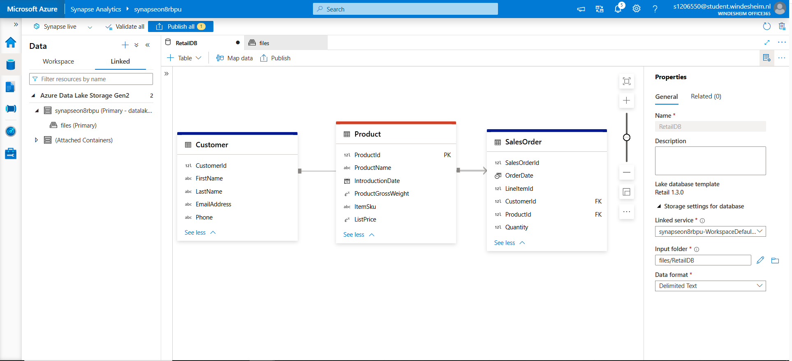
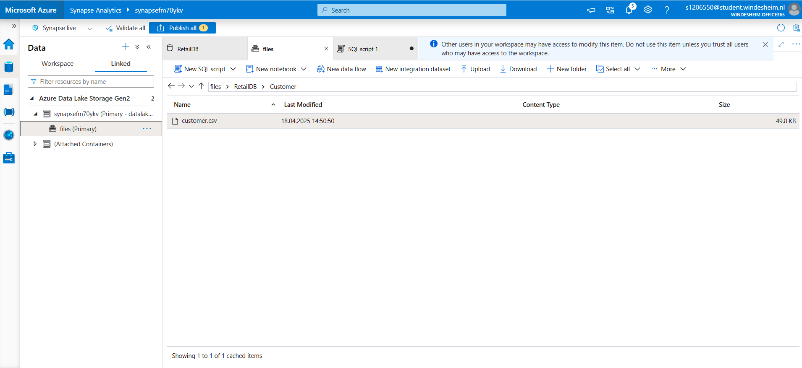
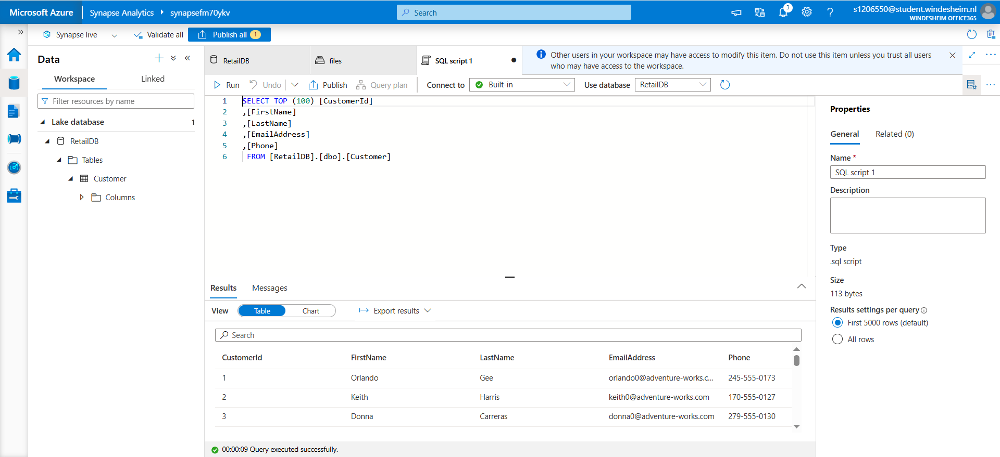
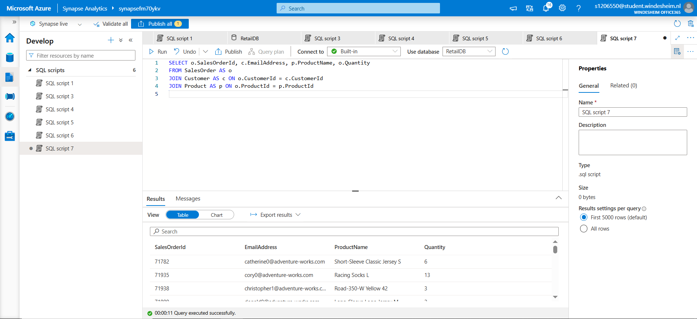

## 🔍 What I Did

### 📌 1. Created Lake Database and Tables

- Created a new **Lake Database** named `RetailDB`.
- Defined tables: `Customer`, `Product`, and `SalesOrder`.
- Designed relationships between tables using primary and foreign keys.
- 

### 📌 2. Uploaded CSV Files to Data Lake

- Uploaded CSV files (e.g., `customer.csv`) to the Azure Data Lake under `RetailDB` folder.
- Verified file structure and size.
- 

### 📌 3. Queried CSV Data with Serverless SQL

- Queried the uploaded CSV using **OPENROWSET** with format and schema parameters.
- Previewed and validated raw data from CSV.
- 

### 📌 4. Queried Tables from Lake Database

- Executed SQL queries directly on the `Customer` table from the Lake DB.
- Verified customer data retrieval worked as expected.
- 
