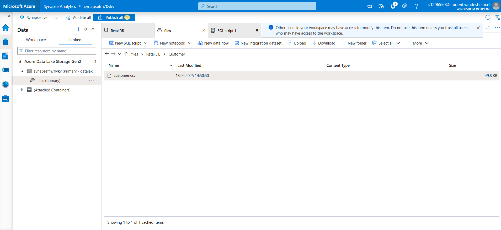
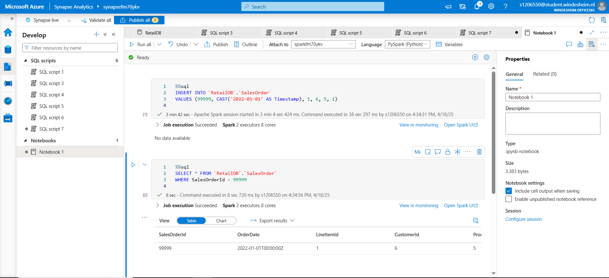

# 📊 Lab 4 - Analyze Data in a Lake Database

> 🧭 [Lab Instructions](https://github.com/secedit/dp-203-azure-data-engineer/blob/master/Instructions/Labs/04-Create-a-Lake-Database.md)

---

## 🛠️ What I Did

### 1. Created a Lake Database

- Created a **Lake Database** named `RetailDB`.
- Used **Lake Database Designer** to define three tables:
  - `Customer`
  - `Product`
  - `SalesOrder`
- Established foreign key relationships between:
  - `SalesOrder.CustomerId` → `Customer.CustomerId`
  - `SalesOrder.ProductId` → `Product.ProductId`
- Specified input folder: `files/RetailDB`
- Set data format to: `Delimited Text`
  
📸 *Screenshot:*  

---

### 2. Uploaded Data to Azure Data Lake

- Uploaded `customer.csv` to Azure Data Lake Gen2 under: /files/RetailDB/Customer/customer.csv
  - Verified upload in the Synapse workspace storage panel.

📸 *Screenshot:*  

---

### 3. Queried the CSV File with SQL

- Created a SQL script in Synapse Studio to directly query the CSV file in the Data Lake.
- Previewed contents with a `SELECT *` command to verify upload.

📸 *Screenshot:*  

---

### 4. Queried the Customer Table in Lake Database

- Executed a SQL script to fetch data from the `Customer` table.
- Fetched `CustomerId`, `FirstName`, `LastName`, `EmailAddress`, and `Phone`.
- Verified table structure and record content.

📸 *Screenshot:*  

---

### 5. Joined Tables to Analyze Orders

- Used SQL script to join the `SalesOrder`, `Customer`, and `Product` tables.
- Retrieved and analyzed:
- Order ID
- Customer Email
- Product Name
- Quantity ordered

📸 *Screenshot:*  

---

## ✅ Summary

Successfully completed Lab 4 and learned how to:

- 📁 Upload data to Azure Data Lake Storage Gen2
- 📐 Design a Lake Database with proper schema and relationships
- 🧮 Query both raw CSV files and structured tables using Synapse SQL
- 🧾 Insert and validate records using Spark SQL Notebooks
- 🔗 Join multiple tables to extract meaningful analytics

---

