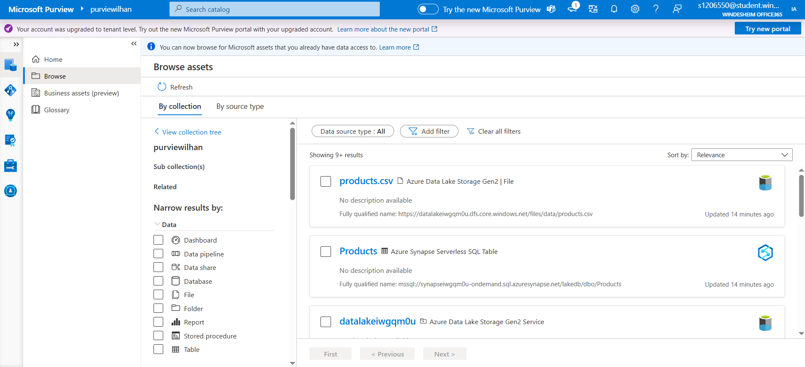

# 🔗 Lab 20 - Integrate Microsoft Purview and Azure Synapse Analytics

> [Lab Instructions](https://github.com/secedit/dp-203-azure-data-engineer/blob/master/Instructions/Labs/22-Synapse-purview.md)

## 📌 Objective
Discover, classify, and track data assets and data lineage in Microsoft Purview for data used in Azure Synapse Analytics.

## 🛠️ Steps Performed

### 1. ⛓️ Data Source Connection and Scan
- Added **Azure Data Lake Gen2** and **Synapse Analytics** sources to Microsoft Purview.
- Successfully scanned the sources and cataloged the data assets.
- 

### 2. 🔍 Asset Discovery
- Discovered assets like **products.csv** and **Products table** in the catalog.
- Matched CSV files with corresponding SQL tables.
- 

### 3. 🔁 Data Lineage Visualization
- Visualized the flow from `products.csv` file to the `Products` table in Synapse.
- Explored lineage relationships schematically.
- 

### 4. 🔐 IAM Configuration
- Assigned roles via IAM to allow Purview access to the necessary resources.
- "Reader" role granted for Storage and Synapse environments.
- 

### 5. 🧾 SQL Querying
- Queried the `Products` table using Azure Synapse SQL.
- Verified and displayed the data successfully.
- 

## 🎯 Key Learnings
- Learned how to use Purview for data discovery and classification.
- Gained hands-on experience with lineage tracking integrated into Synapse.
- Understood enterprise-grade data access and authorization models.

