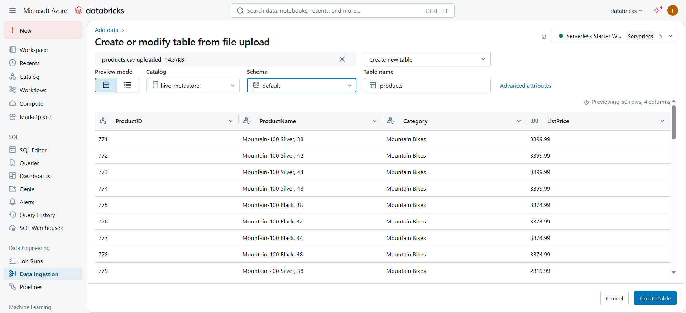
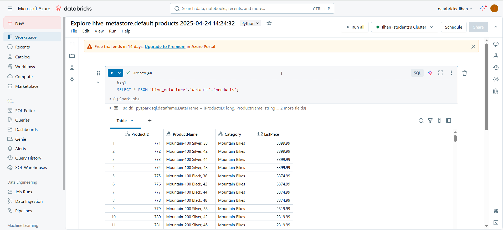
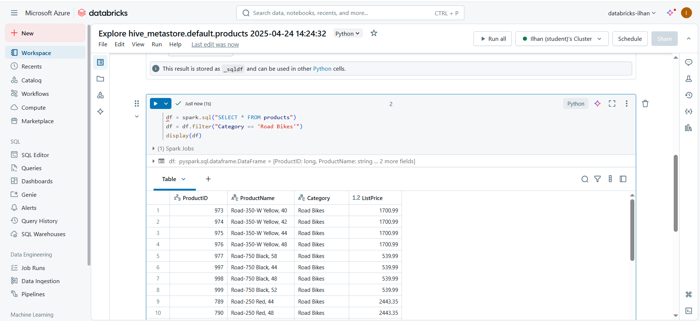
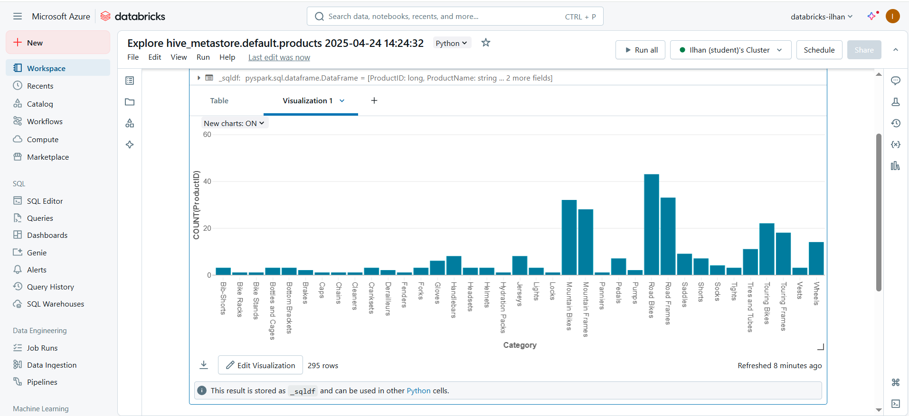

# 🧪 Lab 21 - Explore Azure Databricks

> [Lab Instructions](https://microsoftlearning.github.io/mslearn-databricks/Instructions/Exercises/LA-01-Explore-Azure-Databricks.html)

## 📌 Objective
To explore Azure Databricks for data ingestion, querying using Spark SQL, and visualizing data interactively within notebooks.

## 🛠️ Steps Performed

### 1. 📥 Table Creation via File Upload
- Uploaded `products.csv` file into the Databricks workspace.
- Created a new table in the `hive_metastore.default` schema using the uploaded file.
- 📸 *Screenshot:*  
  

### 2. 📊 SQL Query on Table
- Ran a `%sql` cell to query all records from the `products` table.
- Verified the successful data ingestion and table schema.
- 📸 *Screenshot:*  
  

### 3. 🧠 Filtered Data Using PySpark
- Used `spark.sql` to query products.
- Filtered products where `Category == 'Road Bikes'` using PySpark DataFrame operations.
- 📸 *Screenshot:*  
  

### 4. 📈 Data Visualization
- Visualized product counts per category using built-in chart tools.
- Displayed results as a bar chart inside the notebook.
- 📸 *Screenshot:*  
  

---

✅ **Lab 21 successfully completed!**  
🚀 Learned how to use Azure Databricks for data ingestion, transformation, and visualization in an interactive notebook environment.

